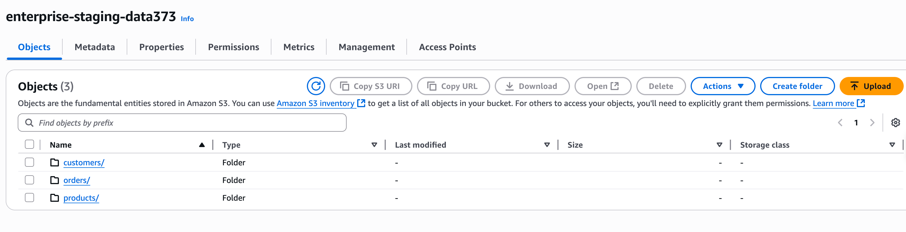
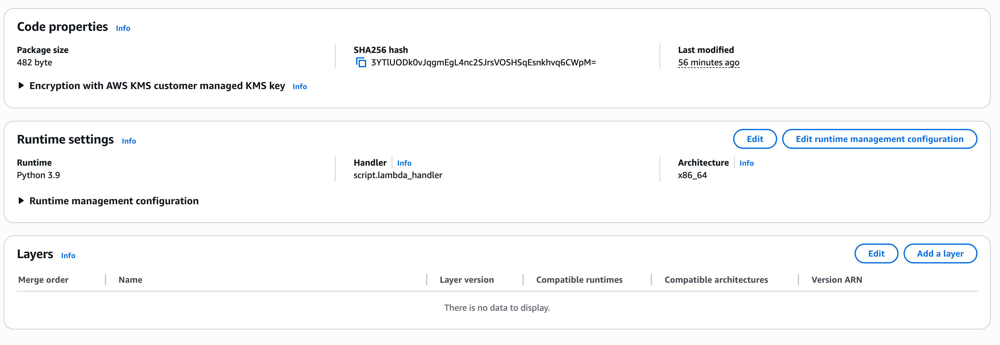

# 🧭 AWS ETL Pipeline – Enterprise Analytics

### 🚀 End-to-End Serverless Data Engineering Project

This project demonstrates a **fully automated, serverless ETL (Extract–Transform–Load) pipeline** built entirely on **AWS**.  
It ingests raw data into S3, transforms it using **AWS Glue**, orchestrates automation through **Lambda** and **EventBridge**, catalogs processed data with a **Glue Crawler**, and enables analytics directly from **Athena** — all with real-time monitoring and alerts.

---

## 🌐 Architecture Overview

  

### **Pipeline Flow**

S3 (staging upload)

↓ triggers

Lambda (trigger_glue_etl)

↓

AWS Glue ETL Job (transform_staging_to_processed)

↓

S3 (processed - Parquet output)

↓

EventBridge → Lambda (trigger_glue_crawler)

↓

Glue Crawler → Data Catalog

↓

Athena SQL Queries / BI Dashboards

↓

CloudWatch + SNS → Monitoring & Alerts

---

## ⚙️ Tools & Technologies Used

| Category | Services / Tools |
|-----------|------------------|
| **Cloud Platform** | AWS |
| **Storage** | Amazon S3 |
| **ETL Engine** | AWS Glue (PySpark) |
| **Orchestration** | AWS Lambda, EventBridge |
| **Catalog & Query** | AWS Glue Crawler, AWS Athena |
| **Monitoring** | Amazon CloudWatch, Amazon SNS |
| **Automation / Scheduling** | EventBridge Rules |
| **Language** | Python 3 |
| **Data Format** | CSV → Parquet (partitioned by year) |

---

## 🧱 Repository Structure

data_sample/ → raw/staging CSV datasets

docker/ → Docker placeholders for future containerization

docs/ → documentation and screenshots

src/ → all pipeline scripts (ETL, Lambda, etc.)

requirements.txt → dependencies (boto3, pandas)

README.md → project overview (this file)

---

## 📂 Data Flow Breakdown

### 🪣 **1. S3 – Data Ingestion Layer**
- Bucket: `enterprise-staging-data373`
- Contains raw data for:
  - Customers  
  - Orders  
  - Products  
- Uploading a new file here automatically triggers the pipeline.

  

---

### ⚡ **2. Lambda – Orchestration Trigger**

- **Function:** `trigger_glue_etl`
- **Purpose:** Starts the Glue ETL job when new data lands in S3.  
- Configured with an **S3 event trigger** (`s3:ObjectCreated:*`)  
- Uses **least-privilege IAM policy** to call Glue safely.

  

**Lambda execution log (CloudWatch):**

  

---

### 🔄 **3. AWS Glue – ETL Transformation**

- **Job name:** `transform_staging_to_processed`
- **Language:** PySpark (AWS Glue script)
- Reads customers, orders, products from staging → cleans → joins → adds:
  - `extended_price = ordered_quantity × standard_price`
  - `order_year` for partitioning
- Writes transformed Parquet files to:

#### s3://enterprise-processed-data373/customer_orders_analytics/
